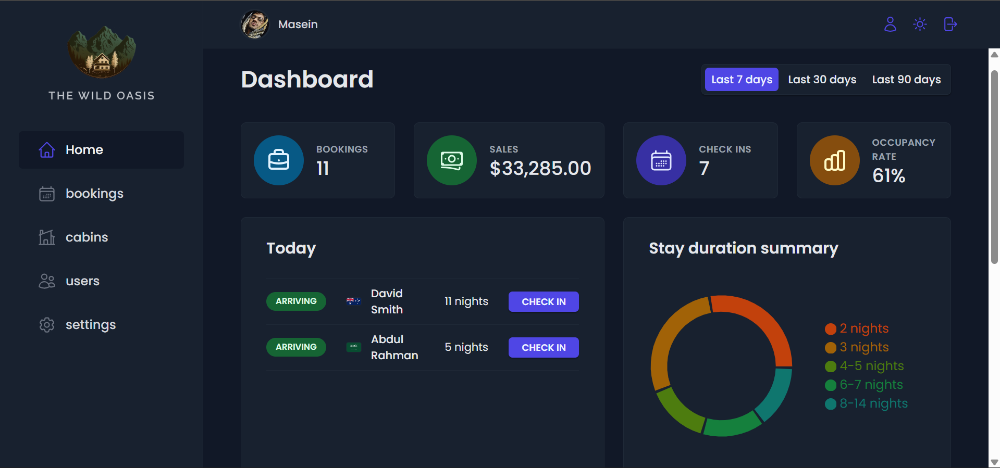

<h1 align="center"> The Wild Oasis 🏩</h1>
<p align="center">

</p>

# Dashboard Web App for control hotel activities.

## A Project by `Jonas Schmedtmann` - React Ultimate Course

## See demo on 👉[this URL](https://the-wild-oasis-masein.netlify.app)👈

## Thanks for visiting my GitHub 🫡♥️

---

# Get Started with Styled Components :

installation: `npm i styled-components`

## 1. Add styled with "styled" function:

`/src/App.jsx`:

```js
import styled from 'styled-components';

const Element = styled.element`
	// CSS styles
	margin: 30px;
	padding: 20px;
`;

const StyledApp = styled.div`
	// Styles for App Component
	padding: 30px;
	background-color: black;
`;

export default function App() {
	return (
		<StyledApp>
			<Element>Foo Baz</Element>
		</StyledApp>
	);
}
```

## 2. Add Global Styles with Styled Components:

`/src/styles/GlobalStyles.js`:

```js
import { createGlobalStyle } from 'styled-components';

const GlobalStyles = createGlobalStyle`
    // Global Styles CSS
`;

export default GlobalStyles;
```

---

`/src/App.jsx`:

```js
import styled from 'styled-components';
import GlobalStyles from './styles/GlobalStyles';

const StyledApp = styled.div`
	// App Component Styles
`;

export default function App() {
	return (
		<>
			<GlobalStyles />
			<StyledApp>// App Children</StyledApp>
		</>
	);
}
```

## 3. Style a Component from outside of the Application:

```js
import { NavLink } from 'react-router';

const StyledNavLink = styled(NavLink)`
	// CSS Styles
`;
```

# Get Started with Supabase :

- ## 1. Create a new project from <strong>[supabase](https://supabase.com)</strong> account.

- ## 2.Create tables template with Table Editor from sidebar.

- ## 3.Add a sample table row for each table with `Insert` tab.

- ## 4.Create a Policy for each table from : Authentication -> Configuration -> Policies

- ## 5.Open Docs for each table from : Integration -> Installed -> Data API -> Docs

---

# I local project:

- ## 1. Installation : `npm i @supabase/supabase-js`
- ## 2. Create supabase client in `services/supabase.js`:

```js
import { createClient } from '@supabase/supabase-js';
const supabaseUrl = import.meta.env.VITE_SUPABASE_URL;
const supabaseKey = import.meta.env.VITE_SUPABASE_KEY;
const supabase = createClient(supabaseUrl, supabaseKey);
export default supabase;
```

- ## 3. Use supabase client to request data (GET):

```js
import supabase from './supabase';

export async function getRows() {
	// *(star) means all rows
	const { data, error } = await supabase
		.from('<tableName>')
		.select('<rowName>');
	if (error) {
		console.error(error);
		throw new Error('Table could not get loaded!');
	}
	return data;
}
```

# Get started with React Query:

installation : `npm i @tanstack/react-query` , `npm i -D @tanstack/eslint-plugin-query` , `npm i @tanstack/react-query-devtools`

- ## 1. Setting up React Query:

```js
import {
	useQuery,
	useMutation,
	useQueryClient,
	QueryClient,
	QueryClientProvider,
} from '@tanstack/react-query';
import { getTodos, postTodo } from '../my-api';

// Create a client
const queryClient = new QueryClient();

function App() {
	return (
		// Provide the client to your App
		<QueryClientProvider client={queryClient}>
			<Todos />
		</QueryClientProvider>
	);
}

function Todos() {
	// Access the client
	const queryClient = useQueryClient();

	// Queries
	const query = useQuery({ queryKey: ['todos'], queryFn: getTodos });

	// Mutations
	const mutation = useMutation({
		mutationFn: postTodo,
		onSuccess: () => {
			// Invalidate and refetch
			queryClient.invalidateQueries({ queryKey: ['todos'] });
		},
	});

	return (
		<div>
			<ul>
				{query.data?.map(todo => (
					<li key={todo.id}>{todo.title}</li>
				))}
			</ul>

			<button
				onClick={() => {
					mutation.mutate({
						id: Date.now(),
						title: 'Do Laundry',
					});
				}}
			>
				Add Todo
			</button>
		</div>
	);
}

render(<App />, document.getElementById('root'));
```

## 2. Setting up React Query Devtools:

```js
import { ReactQueryDevtools } from '@tanstack/react-query-devtools';

function App() {
	return (
		<QueryClientProvider client={queryClient}>
			{/* The rest of your application */}
			<ReactQueryDevtools initialIsOpen={false} />
		</QueryClientProvider>
	);
}
```

# Get started with React Hook Form:

installation: `npm install react-hook-form`

## 1.Example:

```js
import { useForm } from 'react-hook-form';

export default function App() {
	const {
		register,
		handleSubmit,
		watch,
		formState: { errors },
	} = useForm();

	const onSubmit = data => console.log(data);

	console.log(watch('example')); // watch input value by passing the name of it

	return (
		/* "handleSubmit" will validate your inputs before invoking "onSubmit" */
		<form onSubmit={handleSubmit(onSubmit)}>
			{/* register your input into the hook by invoking the "register" function */}
			<input defaultValue="test" {...register('example')} />

			{/* include validation with required or other standard HTML validation rules */}
			<input {...register('exampleRequired', { required: true })} />
			{/* errors will return when field validation fails  */}
			{errors.exampleRequired && <span>This field is required</span>}

			<input type="submit" />
		</form>
	);
}
```

## 2.Register Fields:

```js
import { useForm } from 'react-hook-form';

export default function App() {
	const { register, handleSubmit } = useForm();
	const onSubmit = data => console.log(data);

	return (
		<form onSubmit={handleSubmit(onSubmit)}>
			<input {...register('firstName')} />
			<select {...register('gender')}>
				<option value="female">female</option>
				<option value="male">male</option>
				<option value="other">other</option>
			</select>
			<input type="submit" />
		</form>
	);
}
```

## 3.Apply Validation:

```js
import { useForm } from 'react-hook-form';

export default function App() {
	const { register, handleSubmit } = useForm();
	const onSubmit = data => console.log(data);

	return (
		<form onSubmit={handleSubmit(onSubmit)}>
			<input
				{...register('firstName', { required: true, maxLength: 20 })}
			/>
			<input {...register('lastName', { pattern: /^[A-Za-z]+$/i })} />
			<input type="number" {...register('age', { min: 18, max: 99 })} />
			<input type="submit" />
		</form>
	);
}
```

## 4.Integrating with global state

```js
import { useForm } from 'react-hook-form';
import { connect } from 'react-redux';
import updateAction from './actions';

export default function App(props) {
	const { register, handleSubmit, setValue } = useForm({
		defaultValues: {
			firstName: '',
			lastName: '',
		},
	});
	// Submit your data into Redux store
	const onSubmit = data => props.updateAction(data);

	return (
		<form onSubmit={handleSubmit(onSubmit)}>
			<input {...register('firstName')} />
			<input {...register('lastName')} />
			<input type="submit" />
		</form>
	);
}

// Connect your component with redux
connect(
	({ firstName, lastName }) => ({ firstName, lastName }),
	updateAction,
)(YourForm);
```

## 5.Handle Errors:

```js
import { useForm } from 'react-hook-form';

export default function App() {
	const {
		register,
		formState: { errors },
		handleSubmit,
	} = useForm();
	const onSubmit = data => console.log(data);

	return (
		<form onSubmit={handleSubmit(onSubmit)}>
			<input
				{...register('firstName', { required: true })}
				aria-invalid={errors.firstName ? 'true' : 'false'}
			/>
			{errors.firstName?.type === 'required' && (
				<p role="alert">First name is required</p>
			)}

			<input
				{...register('mail', { required: 'Email Address is required' })}
				aria-invalid={errors.mail ? 'true' : 'false'}
			/>
			{errors.mail && <p role="alert">{errors.mail.message}</p>}

			<input type="submit" />
		</form>
	);
}
```

## 6.Integrating with services:

```js
import { Form } from 'react-hook-form';

function App() {
	const { register, control } = useForm();

	return (
		<Form
			action="/api/save" // Send post request with the FormData
			// encType={'application/json'} you can also switch to json object
			onSuccess={() => {
				alert('Your application is updated.');
			}}
			onError={() => {
				alert('Submission has failed.');
			}}
			control={control}
		>
			<input {...register('firstName', { required: true })} />
			<input {...register('lastName', { required: true })} />
			<button>Submit</button>
		</Form>
	);
}
```
